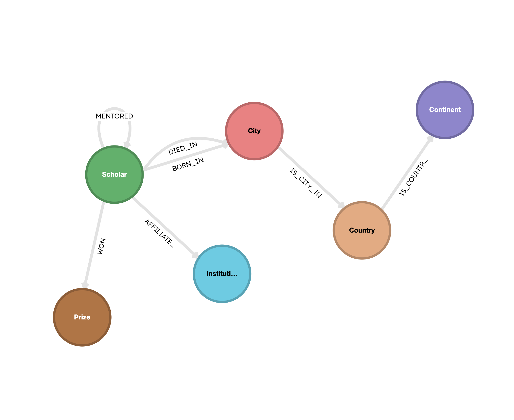
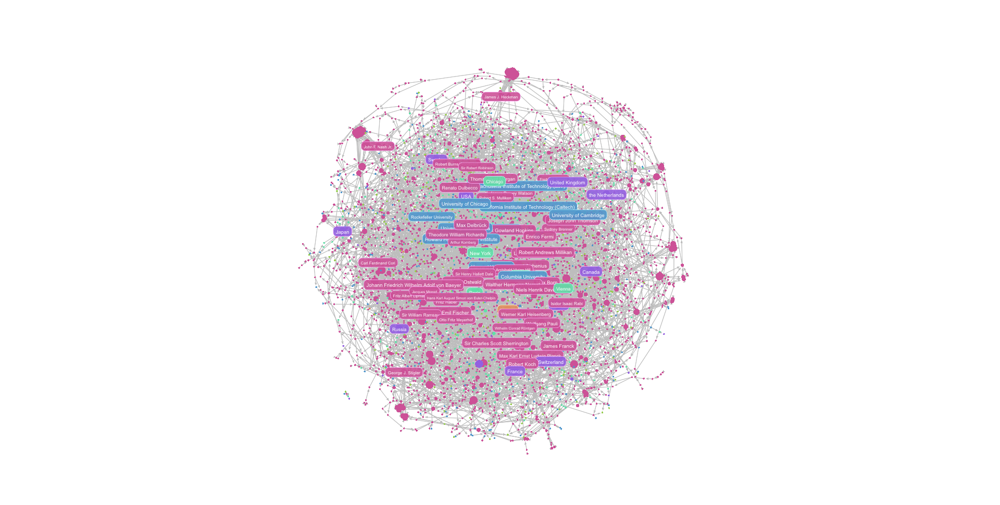

# Graph data enrichment using DSPy and Kuzu

This repo contains an example of using DSPy for graph data enrichment, i.e., enriching data from
one source with data from another
source. We'll do this by reframing the problem as an entity disambiguation task, where we match entities
from the two datasets based on their attributes using vector search, and then merge the data from
the richer of the two sources, to create enriched data that we can then use to build a
more useful knowledge graph in Kuzu.

You can also read our [blog post](https://blog.kuzudb.com/post/graph-data-enrichment-using-dspy/) that
explains this methodology at a higher level.

## Setup

Use [uv](https://docs.astral.sh/uv/) to install the dependencies.

```bash
uv sync
```

To add additional dependencies, use the command `uv add <package>`.

## Dataset

We'll be working with two datasets:
1. A mentorship network of Nobel Laureates and the scholars who mentored them (or who they mentored).
    - This dataset is tree-like, containing only the names of the laureates, the category of the prize they won, and the year they won it.
3. Official Nobel laureate data from the Nobel Prize API.
    - This dataset is _far_ richer, containing detailed information about each laureate, including their biography, birth date, their affiliations, the prize amounts they won, and more.

## Goal

The purpose of this project is to enrich the rather sparse data for each laureate from source 1 (we
just have their name, category, and year of the prize) with the far richer information available in
source 2 (the Nobel Prize API).

> [!IMPORTANT]
> #### What is the role of DSPy in this workflow?
> DSPy performs entity disambiguation to enable us to match and merge similar entities from the two datasets,
> as per the problem statement below:  
> _"Given an entity from source 1, find the exact match from source 2, and obtain an ID mapping_
> _between the two datasets, so that we can merge the data from source 2 into source 1."_

Once the dataset is enriched and persisted to a new JSON file, we can then use it to update
the original mentorship graph with the metadata from the Nobel Prize API, creating a
richer knowledge graph that can answer more useful and complex queries about the laureates and their
mentorship relationships.

## Why DSPy?

[DSPy](https://dspy.ai/) is a declarative framework for building composable and compound AI
applications in a way that seamlessly integrates with non-AI workflows, such as data engineering.
We'll show how DSPy is able to do the entity disambiguation task in a very concise way, and highlight
the key abstractions and primitives it uses that makes this possible.

---

## Information about the datasets

Below, we describe each dataset and how it was obtained, along with a sample of the data, to
illustrate the task above more clearly.

### Data Source 1 (Mentorship Network)

We use a dataset of Nobel Laureates and their mentorship relationships, from this
[open source repo](https://github.com/rtol/NobelNetwork). The dataset was compiled from various sources
for a [research project](https://ideas.repec.org/p/arx/papers/2207.04441.html)
"Nobel begets Nobel", which studied the professor-student network of laureates and other scholars
around them, with the aim of understanding how a laureate's mentorship network could influences
the likelihood of them winning a Nobel Prize.

The data consists of a list of prizes awarded to individuals, along with the year and category of the prize,
with a snippet of the data shown below. A "child" is the student or mentee, and a "parent" is the mentor or professor who influenced the mentee in some way.

```json
[
  {
    "children": [
      {
        "name": "George Smith",
        "type": "laureate",
        "category": "Physics",
        "year": 2009
      }
    ],
    "parents": [
      {
        "name": "Andrew Lawson",
        "type": "scholar"
      }
    ]
  }
]
```

This dataset includes 2000+ scholars (who didn't themselves win Nobel prizes) and 700+ laureates who
won Nobel prizes between the years 1901-2022. The scholars (who worked with or mentored the Nobel laureates)
go back hundreds of years, all the way back to the days of Galileo and Isaac Newton in the 16th & 17th centuries!

The raw data was parsed and extracted from the MATLAB file `NobelTree.m` in the source repository, and
the resulting tree structure of children and parents was converted to a list of dictionaries and
saved to the file `01_source_and_reference/nobeltree.json` in this repo.

### Data Source 2 (Nobel Prize API)

The official [Nobel Prize API](https://nobelprize.org/api/) provides high-quality data about Nobel laureates,
including their biographies, birth dates, affiliations, and more. The API is well-documented and
easy to use, making it a great source of data for our task. This is an example of the data returned by the API
for the same laureate George Smith from the snippet above shown for source 1.

```json
[
  {
    "id": "840",
    "knownName": "George E. Smith",
    "givenName": "George E.",
    "familyName": "Smith",
    "fullName": "George E. Smith",
    "gender": "male",
    "birthDate": "1930-05-10",
    "birthPlaceCity": "White Plains, NY",
    "birthPlaceCountry": "USA",
    "birthPlaceCityNow": "White Plains, NY",
    "birthPlaceCountryNow": "USA",
    "birthPlaceContinent": "North America",
    "deathDate": null,
    "prizes": [
      {
        "awardYear": "2009",
        "category": "Physics",
        "portion": "1/4",
        "dateAwarded": "2009-10-06",
        "motivation": "for the invention of an imaging semiconductor circuit - the CCD sensor",
        "prizeAmount": 10000000,
        "prizeAmountAdjusted": 13471654,
        "affiliations": [
          {
            "name": "Bell Laboratories",
            "nameNow": "Bell Laboratories",
            "city": "Murray Hill, NJ",
            "country": "USA",
            "cityNow": "Murray Hill, NJ",
            "countryNow": "USA",
            "continent": "North America"
          }
        ]
      }
    ]
  }
]
```

---

## Steps

This section describes the high-level methodology we'll take to arrive at the final, high-quality,
enriched dataset that we can use to build a knowledge graph in Kuzu.

### Step 1: Create vector embeddings

The first step is to create vector embeddings for useful text fields from both datasets. The text
on which we generate embeddings must be easily distinguishable in vector space. One example of
this is a concatenation of the laureate's name, the prize category, and the year of the prize.

An example of the `pk` column that forms the primary key (unique identifier) for each laureate
in source 2 is shown below. A similar `pk` column is created for source 1 too.
```
┌─────┬──────────────┬───────────────────────────┬────────────────────────┐
│ id  ┆ knownName    ┆ pk                        ┆ vector                 │
│ --- ┆ ---          ┆ ---                       ┆ ---                    │
│ str ┆ str          ┆ str                       ┆ list[f64]              │
╞═════╪══════════════╪═══════════════════════════╪════════════════════════╡
│ 66  ┆ John Bardeen ┆ john bardeen physics 1956 ┆ [0.027792, 0.05167, …  │
│     ┆              ┆                           ┆ -0.01797…              │
│ 66  ┆ John Bardeen ┆ john bardeen physics 1972 ┆ [0.054792, 0.046317, … │
│     ┆              ┆                           ┆ 0.01238…               │
└─────┴──────────────┴───────────────────────────┴────────────────────────┘
```

The vector embeddings are generated using a locally running Ollama embedding model, and the vectors
are persisted to two different node tables in Kuzu, one for each dataset. The following script is run:

```bash
uv run s1_create_embeddings.py
```

### Step 2: Entity disambiguation workflow in DSPy

Strictly speaking, the task here is very similar to [_data conflation_](https://www.fullcircl.com/glossary/data-conflation),
and benefits from disambiguating between similar entities, since we are trying to merge two datasets that are not exactly the same.
To identify with a high degree of confidence which entities from the two datasets
correspond to the same person, we need to first disambiguate entities based on their attributes.
We use DSPy to run an "LLM-as-a-judge" workflow that can look at
the top 3 most similar entities from source 2 for each entity in source 1 and determine if
they are the same person or not.

The DSPy workflow returns a mapping of the IDs from source 1 to those from source 2, which we can then
use to unify the datasets downstream.

```bash
uv run s2_dspy_workflow.py
```

### Step 3: Merge the datasets

This stage consists of mapping the IDs from source 2 to source 1 and then merging the relevant
data into a new JSON file that can be used as a replacement for `nobeltree.json`, which contained
the initial data from source 1. This new file, `03_merge_datasets/result.json` is original mentorship
network data, but contains the correct primary key ID mapping from the Nobel Prize API for each
laureate, allowing us to merge the enriched data from file `01_source_and_reference/reference.json`
on top of the mentorship graph with a high degree of confidence.

```bash
uv run s3_merge_datasets.py
```

### Step 4: Create the final knowledge graph

We're now ready to create the enriched knowledge graph in Kuzu! The script below reads the
enriched data from `03_merge_datasets/result.json` and the reference data from
`01_source_and_reference/reference.json`, and creates a Kuzu graph that has the following schema:



The full graph contains rich relationships between scholars, prizes, cities, countries and the
institutions they are affiliated with, which we can explore in more detail.

